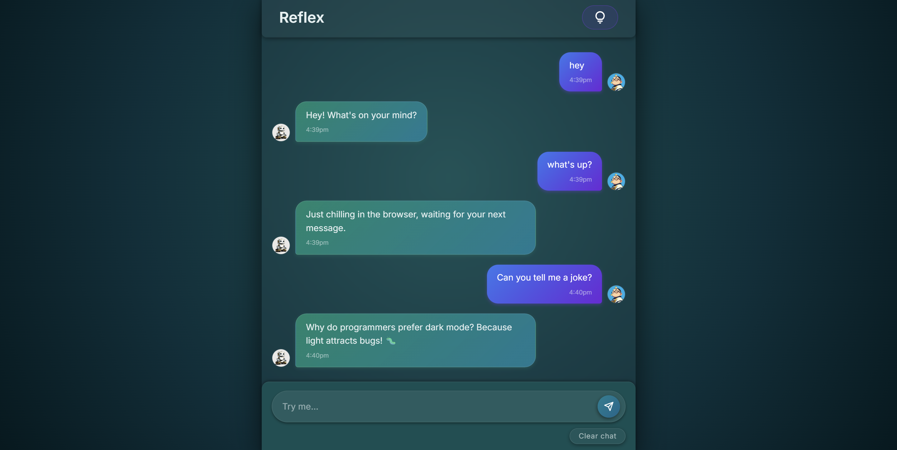

# Reflex

A modern and interactive web-based chatbot built with React.js and Vite, featuring a responsive UI, auto-scrolling chat, and suggestion buttons for a smoother user experience.

## Live demo
[click here](https://reflex-woad.vercel.app/)

Snap shot: 

## Features

- Dynamic Chat Interface - Users can send messages, and the chatbot responds dynamically.

- Auto-Scrolling - The chat automatically scrolls to show the latest messages using a custom React hook.

- Suggestion Buttons - Quick suggestions appear for users to click and send predefined queries.

- Responsive Design - Optimized for both desktop and mobile views.

- Animated Elements - Smooth transitions and visual effects for a modern look.

## Technologies Used

- Frontend: React.js (with JSX)

- Bundler/Dev Server: Vite

- Styling: CSS (modular CSS per component)

- Linting & Code Quality: ESLint

- Assets: PNG, SVG, GIF images

### Backend

This project is entirely a frontend application. Chatbot logic and any network calls are handled by the `supersimpledev` npm package; there is no backend/server code included in the repository.

## Project Structure
```chatbot-project/
├── public/
│   └── snap.png                  
├── src/
│   ├── assets/                   
│   ├── components/               
│   │   ├── ChatInput.jsx
│   │   ├── ChatInput.css
│   │   ├── ChatMessage.jsx
│   │   ├── ChatMessage.css
│   │   ├── ChatMessages.jsx
│   │   ├── ChatMessages.css
│   │   ├── SuggestionsButton.jsx
│   │   └── SuggestionsButton.css
│   ├── hooks/
│   │   └── useAutoScroll.jsx     
│   ├── App.jsx
│   ├── App.css
│   ├── index.css
│   └── main.jsx
├── index.html
├── package.json
├── vite.config.js
├── .npmrc
└── eslint.config.js
```
## Installation

 Clone the repository:

    - git clone https://github.com/sagarpani/Reflex.git

Install dependencies:

    - npm install

Run the development server:

    - npm run dev

Open http://localhost:5173
 in your browser to see the project.

Build for Production
npm run build

The production-ready files will be in the dist/ directory. You can preview the build with:

    - npm run preview

## Usage

- Type a message in the chat input and press Enter or click the send button.

- Use suggestion buttons to quickly send predefined messages.

- The chatbot responses appear with a smooth animation for better UX.

## Contributing

- Fork the project

- Create a branch:
``` git checkout -b feature-name ```

- Make your changes

- Commit your changes: 
``` git commit -m "Description of change"```

- Push to branch: ``` git push origin feature-name ```

- Create a Pull Request

## Author
Built by: Sagar Pani<br>
LinkedIn: [Sagar Pani](https://www.linkedin.com/in/sagarpani)